# 🤖 AI Assistant for Lead Qualification

**An intelligent tool to optimize the Omie/OneFlow sales process, automating lead qualification and prospecting with the power of Google Gemini.**

  
  
  
  
  

  <a href="#-objetivo">Objective</a> •
  <a href="#-funcionalidades">Features</a> •
  <a href="#-arquitetura-e-segurança">Architecture</a> •
  <a href="#-tecnologias-utilizadas">Technologies</a> •
  <a href="#-desafios-e-aprendizados">Learnings</a> •
  <a href="#-autor">Author</a>

---

  

---

## 🎯 Objective

The B2B market is highly competitive. The time of sales professionals (SDRs and Salespeople) is a precious resource, often spent on repetitive tasks such as qualifying leads and creating initial approaches.

> This project directly addresses this pain point, proposing an automation solution that **frees up the sales team's time** to focus on high-value activities, such as negotiations and closing deals. It uses AI to bring intelligence and scale to the top of the sales funnel.

---

## ✨ Features

- **✅ Intelligent Qualification:** Analyzes input data to generate a Fit Score (High, Medium, Low), allowing for instant prioritization.
- **✉️ Relevant Message Generation:** Creates personalized prospecting emails, connecting lead challenges with company solutions.
- **🤔 Strategic Question Suggestion:** Provides open-ended follow-up questions to deepen the conversation and uncover customer pain points.
- **📈 Response Analysis:** Interprets the sentiment of a response email and suggests the most appropriate next steps.
- **🔐 Secure Access Control:** Code-based authentication system that protects the consumption of API resources.
---

## 🏛️ Architecture and Security

Security was a fundamental pillar in the development. The API key is **never exposed on the frontend**. To achieve this, an intermediate backend architecture (_proxy_) was implemented using **Google Cloud Functions**.

```mermaid
graph TD;
    A[👨‍💻 User on Frontend] -- "1. Sends prompt + Access Code" --> B[🛡️ Google Cloud Function];
    B -- "2. Validates the Access Code" --> C{Valid Code?};
    C -- "No" --> D["Returns Error 401"];
    D --> A;
    C -- "Yes" --> E["3. Uses the API Key to call"];
    E --> F[🤖 Google Gemini API];
    F --> E;
    E --> A;

    style B fill:#e3f2fd,stroke:#4285F4,stroke-width:2px;
    style F fill:#dcedc8,stroke:#689f38,stroke-width:2px;
```

> This approach ensures security (Security by Design), access control, and a scalable, low-cost serverless infrastructure.

---

## 🛠️ Technologies Used

| Category | Technology / Tool |
| :--- | :--- |
| **Frontend** | `HTML5`, `JavaScript (ES6)` |
| **Styling** | `Tailwind CSS` |
| **Artificial Intelligence** | `Google Gemini API` |
| **Backend** | `Google Cloud Functions (Node.js)` |
| **Hosting & Deployment** | `GitHub Pages` & `gcloud CLI` |

---

## 🧠 Challenges and Learnings

- **API Key Security:** The main challenge was designing an architecture that did not expose the API key on the client side. The solution using a Cloud Function acting as a proxy was a crucial learning experience in web application security.
- **Infrastructure Debugging:** Dealing with the configuration of environment variables in Google Cloud and debugging CORS and authorization errors (`401 Unauthorized`) provided valuable practical experience in DevOps and cloud infrastructure.
- **Asynchronous Handling:** Reinforced knowledge of `async/await` and handling `Promises` to handle API requests and interface updates in a non-blocking way.

---

## 🚀 How to Use

1. Access the [**Live Demo**](https://matheusterr.github.io/AI-Assistant/).
2. Fill in the information for the lead you wish to analyze.
3. Enter the **Access Code** to enable the AI ​​functionalities.
4. Use the buttons to qualify, generate messages, and obtain insights.

---

## ✍️ Author

 Made with ❤️ by Matheus Terr.

  
  

