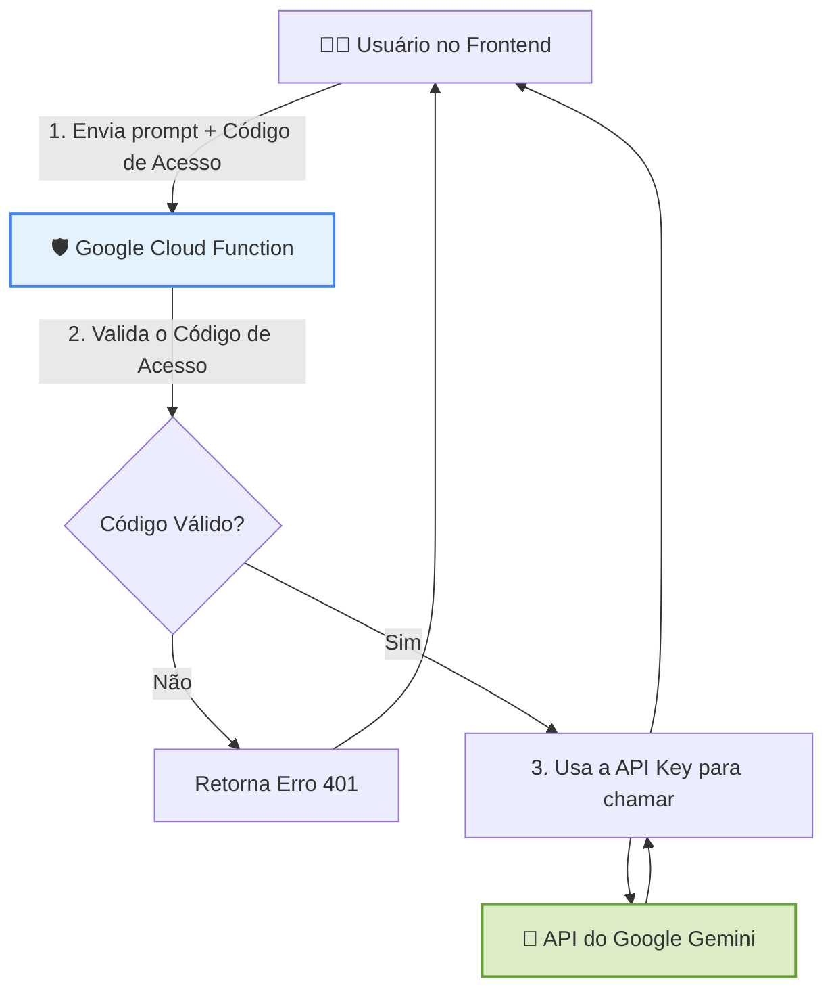

# 🤖 Assistente de IA para Qualificação de Leads

**Uma ferramenta inteligente para otimizar o processo de vendas da Omie/OneFlow, automatizando a qualificação e a prospecção de leads com o poder do Google Gemini.**

  
  
  
  
  

  <a href="#-objetivo">Objetivo</a> •
  <a href="#-funcionalidades">Funcionalidades</a> •
  <a href="#-arquitetura-e-segurança">Arquitetura</a> •
  <a href="#-tecnologias-utilizadas">Tecnologias</a> •
  <a href="#-desafios-e-aprendizados">Aprendizados</a> •
  <a href="#-autor">Autor</a>

---

  

---

## 🎯 Objetivo

O mercado B2B é altamente competitivo. O tempo dos profissionais de vendas (SDRs e Vendedores) é um recurso precioso, muitas vezes gasto em tarefas repetitivas de qualificação e criação de abordagens iniciais.

> Este projeto ataca diretamente essa dor, propondo uma solução de automação que **libera o tempo da equipe comercial** para focar em atividades de alto valor, como negociações e fechamento de negócios. Utiliza IA para trazer inteligência e escala ao topo do funil de vendas.

---

## ✨ Funcionalidades

- **✅ Qualificação Inteligente:** Analisa dados de entrada para gerar um _Score de Fit_ (Alto, Médio, Baixo), permitindo a priorização instantânea.
- **✉️ Geração de Mensagens Relevantes:** Cria e-mails de prospecção personalizados, conectando os desafios do lead com as soluções da empresa.
- **🤔 Sugestão de Perguntas Estratégicas:** Fornece perguntas de follow-up abertas para aprofundar a conversa e descobrir as dores do cliente.
- **📈 Análise de Resposta:** Interpreta o sentimento de um e-mail de resposta e sugere os próximos passos mais adequados.
- **🔐 Controle de Acesso Seguro:** Sistema de autenticação por código que protege o consumo dos recursos da API.

---

## 🏛️ Arquitetura e Segurança

A segurança foi um pilar fundamental no desenvolvimento. A chave da API **nunca é exposta no frontend**. Para isso, foi implementada uma arquitetura de backend intermediário (_proxy_) utilizando **Google Cloud Functions**.

> Esta abordagem garante segurança (_Security by Design_), controle de acesso e uma infraestrutura serverless escalável e de baixo custo.

---

## 🛠️ Tecnologias Utilizadas

| Categoria | Tecnologia / Ferramenta |
| :--- | :--- |
| **Frontend** | `HTML5`, `JavaScript (ES6)` |
| **Estilização** | `Tailwind CSS` |
| **Inteligência Artificial** | `Google Gemini API` |
| **Backend** | `Google Cloud Functions (Node.js)` |
| **Hospedagem & Deploy** | `GitHub Pages` & `gcloud CLI`|

---

## 🧠 Desafios e Aprendizados

- **Segurança da API Key:** O principal desafio foi projetar uma arquitetura que não expusesse a chave da API no lado do cliente. A solução com uma Cloud Function atuando como proxy foi um aprendizado crucial em segurança de aplicações web.
- **Depuração de Infraestrutura:** Lidar com a configuração de variáveis de ambiente no Google Cloud e depurar erros de CORS e autorização (`401 Unauthorized`) proporcionou uma experiência prática valiosa em DevOps e infraestrutura na nuvem.
- **Manipulação Assíncrona:** Reforçou o conhecimento em `async/await` e no tratamento de `Promises` para lidar com as requisições à API e a atualização da interface de forma não bloqueante.

---

## 🚀 Como Utilizar

1.  Acesse a [**Demonstração Ao Vivo**](https://matheusterr.github.io/AI-Assistant/).
2.  Preencha as informações do lead que deseja analisar.
3.  Insira o **Código de Acesso** para habilitar as funcionalidades de IA.
4.  Utilize os botões para qualificar, gerar mensagens e obter insights.

---

## ✍️ Autor

  Feito com ❤️ por Matheus Terr.

  
  

